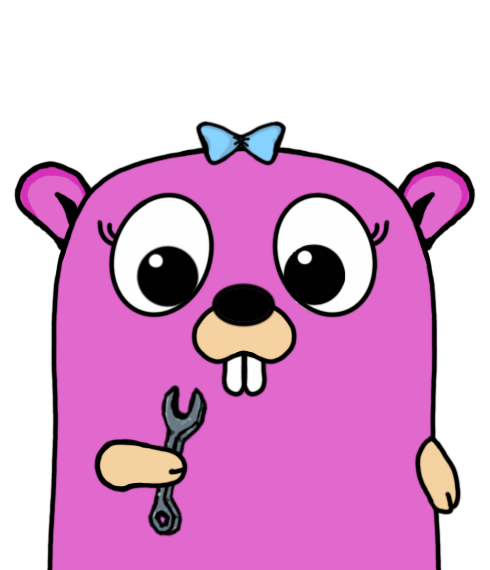

# gURL - A cURL replacement developed in Go

<p align="center">
    
</p>

This is developed because, the default curl binary provided via the Alpine packages registry doesn't support kerberos authentication.

*NOTE: It supports just the `GET` method currently*

---

## gURL can be statically compiled for Linux

```shell
env CGO_ENABLED=0 GOOS=linux GOARCH=amd64 go build -mod=vendor -a -installsuffix cgo -gcflags=all='-l -B' -ldflags '-s -w' -o gurl
```

## Building the docker container

```shell
docker build --build-arg BASE_IMAGE_VERSION=3.16 --build-arg ALPINE_VERSION=3.16 --build-arg GO_VERSION=1.19 -t gurl:latest .
```

---

## Options

```shell
Flags: 
    --version              Displays the program version string.
-h --help                 Displays help with available flag, subcommand, and positional value parameters.
-l --url                  URL to make request
-X --type                 HTTP request type to use (default: GET)
-k --kerberized           Is Kerberos enabled for the URL
-kt --keytab-path          Kerberos Keytab Path (default: /etc/security/hdfs-headless.keytab)
-kp --kerberos-principle   Kerberos principle to use with keytab (default: hdfs@ACME.ORG)
-ts --ts-format            Timestamp format klist uses in 'Go Time Format'. Example: 'mm/dd/yyyy' => '01/02/2006' (default: 02/01/2006)
-u --basic-auth           Is Basic Auth Enabled for the URL
-ev --enforce-tls-verify   Enforce TLS certification verification
-ua --user-agent           User Agent to be set for the client requests (default: curl/7.29.0)
-o --output-file          Write the request response to a file

```

---

## Usage

```shell
gurl -X GET -ev -ua "gurl/0.0.1" -l "https://acceldata.io/" -o /tmp/output
```

```shell
gurl -X GET -ua "gurl/0.0.1" -u "username:secret" -k -kt /etc/security/hdfs-headless.keytab -kp hdfs@ACME.ORG -ts '01/02/2006' -l "http://node.acme.org:9871/"
```

---
